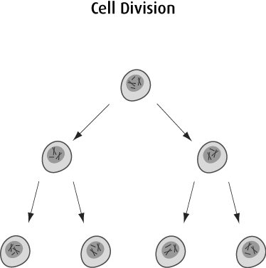
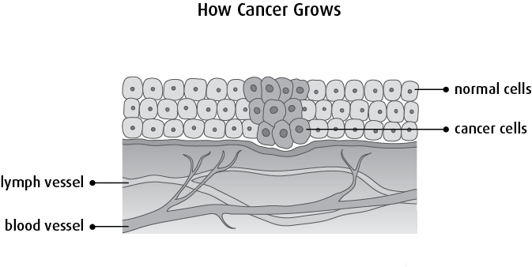
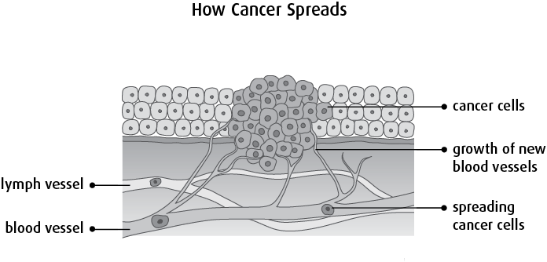

# Cells and Cancer

## Cell Growth and a Model for Cancer

Standard model of cell growth involves cells dividing, and creating exact copies of themselves.  Normally, cells are programmed to grow and divide only in certain circumstances. A basic model of cancer involves a cell that continues to grow where normal cells would stop dividing; and a cluster of growing cells develops into a tumor.

(figures taken from [cancer.ca](https://www.cancer.ca/en/cancer-information/cancer-101/what-is-cancer/how-cancer-starts-grows-and-spreads/?region=on))

---

Up:  [index.md](index.md) 

Next:  [02-Cell-Structure.md](02-Cell-Structure.md) 

