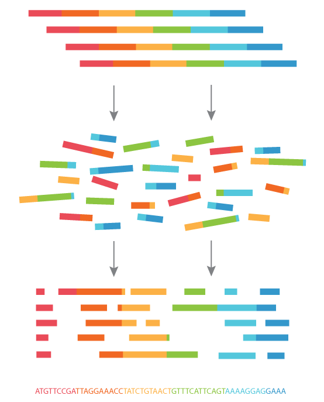
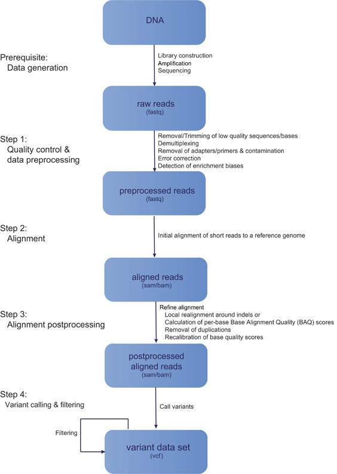

# Next-Generation Sequencing (NGS)

Just a *wee-bit* complicated

Amplified/Template DNA --> Short Reads from Sequencer (FASTQ) --> Mapped reads (BAM) --> sequence !

(figure taken from [abmgood.com](https://old.abmgood.com/marketing/knowledge_base/next_generation_sequencing_data_analysis.php))

## Overall Steps

* <u>Sample preparation</u> (extract dna from biological sample)
* <u>Library Preparation</u>, Construction (chop up DNA into fragments)
* <u>Sequencing</u>
  * raw sequencing reads captured:  BCL
  * (on sequencer) BCL converted and then converted FASTQ
    * FASTQ = FASTA + quality info
      * Sequence identifier
      * Nucleotide sequence - aka the *read*
      * Phred quality info per base
* <u>Data Analysis</u>
  * Quality Control, including trimming and/or filtering reads ()
  * Align reads to reference genome: FASTQ --> SAM/BAM
  * Alignment Cleanup: BAM
  * Variant Calling (VCF)
  * Variant Annotation
    * Add information for each variant: symbol, name, transcript, amino acid sequence
    * COSMIC, dbSNP/1000 genomes, panel of normals, etc
  * Variant Filtering - Biological
    * In a clinical setting, usually no matched normal --> Remove unimportant variants 
    * Remove known germline variants in population; Improving databases (e.g. dbSNP -> 1000 genomes -> 1000 genomes -> SweGen)
  * Variant Filtering - Technical
    * VAR cutoff, read depth, variant quality score
    * Panel of normals
  * General Quality Control
    * Base quality, GC bias, distinct reads, percent reads mapped, mapping quality, average depth on target region, uniformity, etc

## Data Analysis

Steps in a typical next-generation resequencing workflow. *De facto* standard file formats are given in parentheses.

(figure taken from [nature.com](https://www.nature.com/articles/hdy2016102.pdf))

---

Prev:  [05-Medical-Genetics.md](05-Medical-Genetics.md) 

Next:  [07-Types-of-NGS.md](07-Types-of-NGS.md) 

