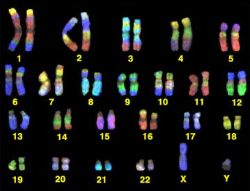
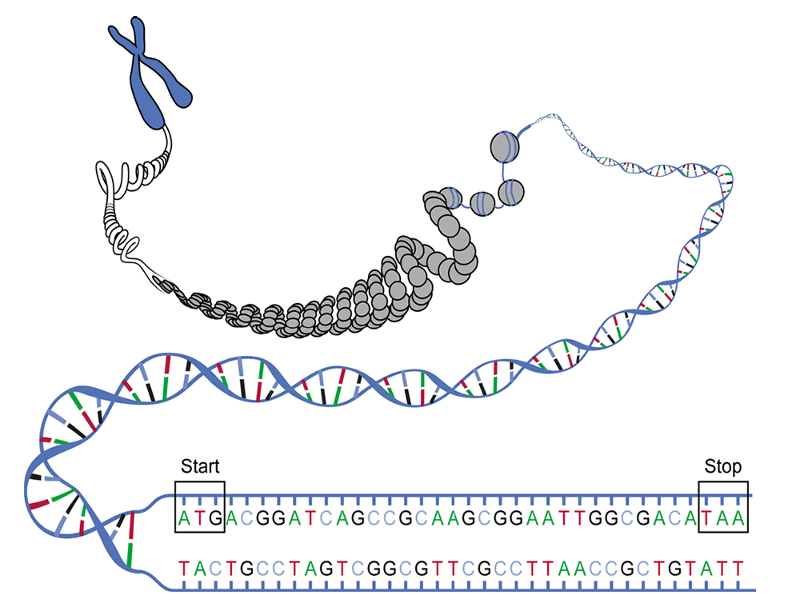
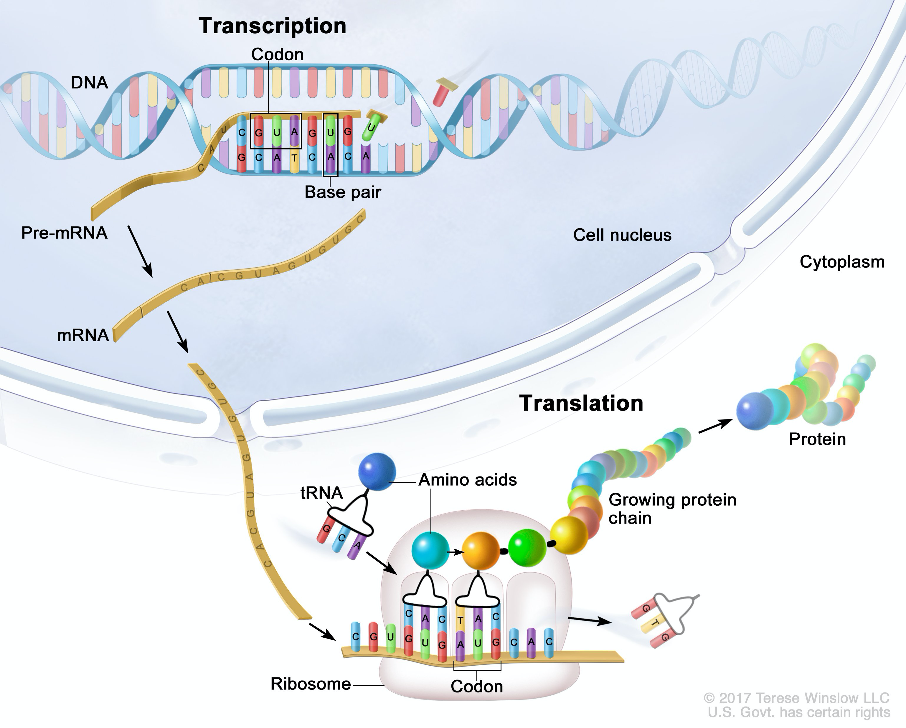
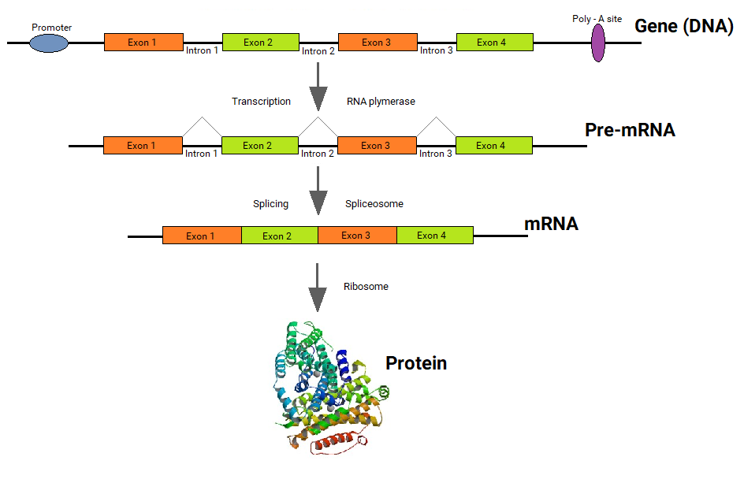

# Central Dogma

(taken from [wikimedia.org](https://commons.wikimedia.org/wiki/File:Central_dogma_of_molecular_biology.svg))

(figure from [cancer.gov](https://visualsonline.cancer.gov/details.cfm?imageid=1168))

## Transcription

Strands of RNA can be referred to as "transcripts".   RNA is usually spliced, processed, and modified before it is ready for translation.  

Important!  Several different transcripts can be generated from a single gene. 

(figure taken from [wikipedia.org](https://en.wikipedia.org/wiki/Alternative_splicing))

## Translation

In RNA, units of three nucleotides that encode for amino acids are referred to as codons.

(figure taken from [nature.com](https://www.nature.com/scitable/topicpage/translation-dna-to-mrna-to-protein-393/))

(figure taken from [genome.gov](https://www.genome.gov/genetics-glossary/Genetic-Code))

## FYI

* ~2% of mammalian DNA is comprised of exons.

---

[index](https://cbiit.github.io/brownbag-science/02-sequencing)
