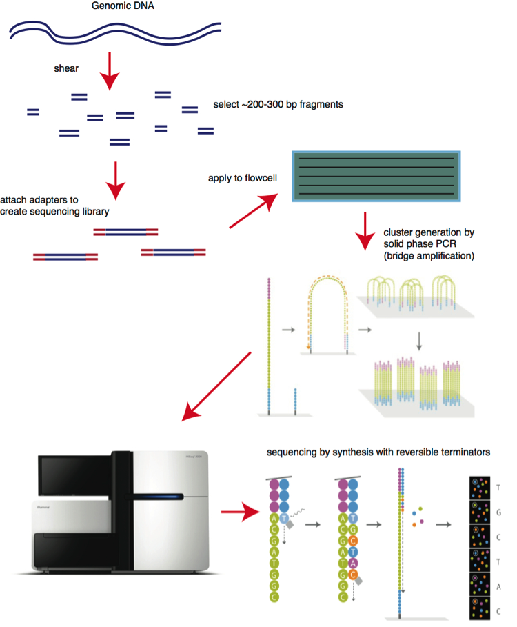

# illumina

## Workflow

**Step 1. Library preparation**

Through ultrasonic fragmentation, the genomic DNA becomes DNA  fragment with 200-500bp in length. The 5’ and 3’ adapter are added to  the two ends of these small segments, “tagmentation” combines the  fragmentation and ligation reactions into single step that greatly  increases the efficiency of the library preparation process.  Adapter-ligated fragments are then PCR amplified and gel purified. The  sequencing library is constructed.

Figure 1. The 1st step: library preparation

**Step 2. Cluster generation**

Flow cell is a channel for adsorbing mobile DNA fragments, and it’s  also a core sequencing reactor vessel — all the sequencing happens here. The DNA fragments in the sequencing library will randomly attach to the lanes on the surface of the flow cell when they pass through it. Each  flow cell has 8 Lanes, each lane has a number of adapters attached to  the surface, which can match the adapters added at the ends of the DNA  fragment in the building process, which is why flow cell can adsorb the  DNA after the building, and can support the amplification of the bridge  PCR on the surface of the DNA. In theory, there is no mutual influence  between these lanes.

Bridge PCR was performed using the adapters on flow cell surface as  template, after continuous amplification and mutation cycles, each DNA  fragment will eventually be clustered in bundles at their respective  locations, each containing many copies of a single DNA template.

The purpose of this process is to amplify the signal intensity of the base to meet the signal requirements for sequencing. When cluster  generation is complete, those templates are ready for sequencing.

Figure 2. The 2nd step: cluster generation

**Step 3. Sequencing** 

The sequencing method is based on sequencing-by-synthesis (SBS). DNA  polymerase, connector primers and 4 dNTP with base-specific fluorescent  markers were added to the reaction system. The 3′-OH of these dNTP are  protected by chemical methods, which ensures that only one base will be  added at a time during the sequencing process. All unused free dNTP and  DNA polymerase are eluted after the synthesis reaction finished.

Then, buffer solution needed for fluorescence excitation are added,  the fluorescence signal is excited by laser, and fluorescence signal is  recorded by optical equipment.

Finally, the optical signal is converted into sequencing base by  computer analysis. When the fluorescence signal is recorded, a chemical  reagent is added to quench the fluorescence signal and remove the dNTP  3′-OH protective group, so that the next round of sequencing reaction  can be performed.

Figure 3. The 3rd step: sequencing

**Step 4. Alignment & Data analysis**

The newly identified sequence reads are aligned to a reference  genome, then many variations of bioinformatics analysis are possible  such as SNP/InDel/SV/CNV calling, annotation and statistics, pathway  enrichment analysis, population genetics analysis and more.

Figure 4. The 4th step: alignment and data analysis.

The above is Illumina NGS chemistry overview, the SBS technology  allows single-end and two-end sequencing, improves the ability to fully  identify any genome.