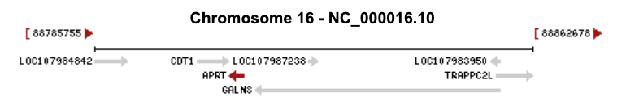

# NCBI Resources

GenBank® ([www.ncbi.nlm.nih.gov/genbank/](http://www.ncbi.nlm.nih.gov/genbank/)) is a comprehensive, public database that contains over **6.25 trillion base pairs** from over **1.6 billion nucleotide sequence**s for 450 000 formally described species. Daily data exchange with the European Nucleotide Archive (ENA) and the DNA Data Bank of Japan (DDBJ) ensures worldwide coverage.

NCBI is a primary steward for biological sequence databases

* [RefSeq (Reference Sequence)](https://www.ncbi.nlm.nih.gov/RefSeq/): A collection of <u>curated</u>, non-redundant genomic DNA, transcript (RNA), and protein sequences produced by NCBI.
* [GenBank](https://www.ncbi.nlm.nih.gov/genbank/): collection of submitted DNA sequences (Standard Sequences, International Consortium -- not NCBI "owned")

* [Gene](https://www.ncbi.nlm.nih.gov/gene)
* [dbGaP](https://www.ncbi.nlm.nih.gov/gap/):  data and results from studies that have investigated the interaction of genotype and phenotype in Humans
* [dbSNP](https://www.ncbi.nlm.nih.gov/snp/)

* [Clinvar](https://www.ncbi.nlm.nih.gov/clinvar/): Clinically relevant variants

Note: each resource usually has its own identifier

## Example

**Symbol**:	   [APRT](https://www.ncbi.nlm.nih.gov/gene/353) 	

**Name**:	     adenine phosphoribosyltransferase

**Location**:	Chromosome 16  (88809339..88811928, complement)

|           | Transcript     | Protein        |
| --------- | -------------- | -------------- |
| variant 1 | NM_000485.3    | NP_000476.1    |
| variant 2 | NM_001030018.2 | NP_001025189.1 |

## Nomenclature

### Location

* Genomic (NC) -- **C**hromosome
  * GRCh38
  * GRCh37
* Transcript (NM) -- **m**RNA
* Gene (NG) 
* Protein (NP)

Also see: [HGVS](https://varnomen.hgvs.org/) *the* standard notation / nomenclature for variants

---

Prev:  [03-Central-Dogma.md](03-Central-Dogma.md) 

Next:  [05-Medical-Genetics.md](05-Medical-Genetics.md) 

