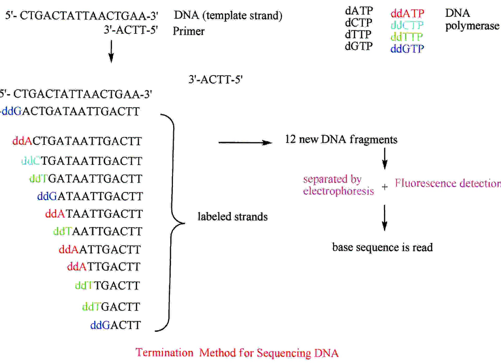
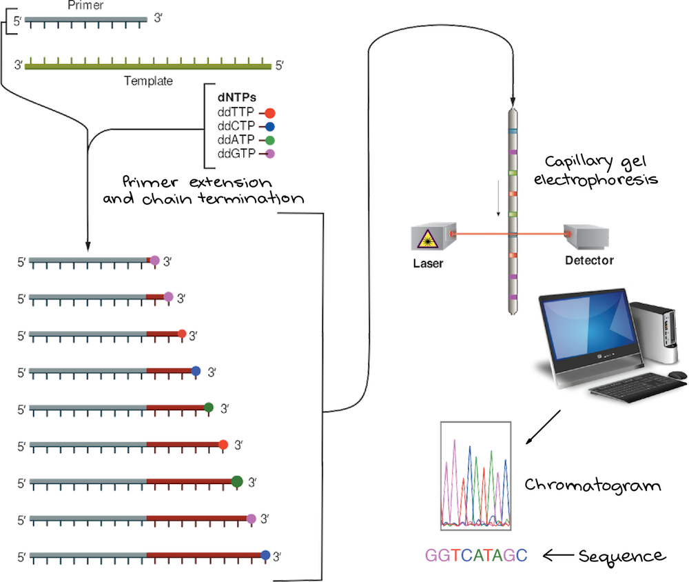
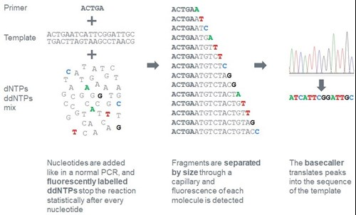

# Sanger Sequencing

 

## Workflow Detail

### Summary

Dideoxy sequencing is based on synthesis of DNA strands that are  complementary to a template DNA strand. The sequencing reaction uses  normal deoxynucleoside triphosphates (dNTPs) and modified  dideoxynucleoside triphosphates (ddNTPs) for strand elongation. The  ddNTPs are chemically altered with a fluorescent label and with a  chemical group that inhibits phosphodiester bond formation, causing DNA  polymerase to stop DNA extension whenever a ddNTP is incorporated. The  resulting DNA fragments are subjected to capillary electrophoresis,  where the fragments flow through a gel-like matrix at different speeds  according to their size. Each of the four modified ddNTPs carries a  distinct fluorescent label. The emitted fluorescence signal from each  excited fluorescent dye determines the identity of the nucleotide in the original DNA template. 

### Key points:

- **DNA sequencing** is the process of determining the sequence of nucleotides (As, Ts, Cs, and Gs) in a piece of DNA.
- In **Sanger sequencing**, the target DNA is copied many times, making fragments of different  lengths. Fluorescent “chain terminator” nucleotides mark the ends of the fragments and allow the sequence to be determined.
- **Next-generation sequencing** techniques are new, large-scale approaches that increase the speed and reduce the cost of DNA sequencing.

### What is sequencing?

You may have heard of genomes being sequenced. For instance, the human  genome was completed in 2003, after a many-year, international effort.   But what does it mean to sequence a genome, or even a  small fragment of DNA?

**DNA sequencing** is the process of determining the sequence of nucleotide bases (As, Ts, Cs, and Gs) in a piece of DNA. Today, with the right equipment and  materials, sequencing a short piece of DNA is relatively  straightforward.

Sequencing an entire genome (all of an organism’s DNA) remains a complex task. It  requires breaking the DNA of the genome into many smaller pieces,  sequencing the pieces, and assembling the sequences into a single long  "consensus." However, thanks to new methods that have been developed  over the past two decades, genome sequencing is now much faster and less expensive than it was during the Human Genome Project1^11start superscript, 1, end superscript.

In this article, we’ll take a look at methods used for DNA sequencing.  We'll focus on one well-established method, Sanger sequencing, but we'll  also discuss new ("next-generation") methods that have reduced the  cost and accelerated the speed of large-scale sequencing.

### Sanger sequencing: The chain termination method

Regions of DNA up to about 900900900900 base pairs in length are routinely sequenced using a method called **Sanger sequencing** or the **chain termination method**. Sanger sequencing was developed by the British biochemist Fred Sanger and his colleagues in 1977.

In the Human Genome Project, Sanger sequencing was used to determine the  sequences of many relatively small fragments of human DNA. (These  fragments  weren't necessarily 900900900900 bp or less, but researchers were able to "walk" along each fragment  using multiple rounds of Sanger sequencing.) The fragments were aligned  based on overlapping portions to assemble the sequences of larger  regions of DNA and, eventually, entire chromosomes.

Although genomes are now typically sequenced using other methods that are faster and less expensive, Sanger sequencing is still in wide use for the  sequencing of individual pieces of DNA, such as fragments used in [DNA cloning](https://www.khanacademy.org/science/biology/biotech-dna-technology/dna-cloning-tutorial/a/overview-dna-cloning) or generated through [polymerase chain reaction](https://www.khanacademy.org/science/biology/biotech-dna-technology/dna-sequencing-pcr-electrophoresis/a/polymerase-chain-reaction-pcr) (PCR).

### Ingredients for Sanger sequencing

Sanger sequencing involves making many copies of a target DNA region. Its ingredients are similar to those needed for [DNA replication](https://www.khanacademy.org/science/biology/dna-as-the-genetic-material/dna-replication/a/molecular-mechanism-of-dna-replication) in an organism, or for polymerase chain reaction (PCR), which copies DNA *in vitro*. They include:

- A DNA polymerase enzyme
- A **primer**, which is a short piece of single-stranded DNA that binds to the template DNA and acts as a "starter" for the polymerase
- The four DNA nucleotides (dATP, dTTP, dCTP, dGTP)
- The template DNA to be sequenced

However, a Sanger sequencing reaction also contains a unique ingredient:

- Dideoxy, or **chain-terminating**, versions of all four nucleotides (ddATP, ddTTP, ddCTP, ddGTP), each labeled with a different color of dye

_Image credit: "[Whole-genome sequencing: Figure 1](http://cnx.org/contents/GFy_h8cu@10.7:5l844Z38@7/Whole-Genome-Sequencing)," by OpenStax College, Biology ([CC BY 4.0](http://creativecommons.org/licenses/by/4.0/))._

Dideoxy nucleotides are similar to regular, or deoxy, nucleotides, but with one key difference: they lack a hydroxyl group on the 3’ carbon of the  sugar ring. In a regular nucleotide, the 3’ hydroxyl group acts as a  “hook," allowing a new nucleotide to be added to an existing chain.

Once a dideoxy nucleotide has been added to the chain, there is no hydroxyl  available and no further nucleotides can be added. The chain ends with  the dideoxy nucleotide, which is marked with a particular color of dye   depending on the base (A, T, C or G) that it carries.

[[Hide explanation\]](javascript:void(0))

The dye molecule on a dideoxy nucleotide is linked to the nitrogenous base.

### Method of Sanger sequencing

The DNA sample to be sequenced is combined in a tube with primer, DNA  polymerase, and DNA nucleotides (dATP, dTTP, dGTP, and dCTP). The four  dye-labeled, chain-terminating dideoxy nucleotides are added as well,   but in much smaller amounts than the ordinary nucleotides.

The mixture is first heated to denature the template DNA (separate the  strands), then cooled so that the primer can bind to the single-stranded template. Once the primer has bound, the temperature is raised again,  allowing DNA polymerase to synthesize new DNA starting from the primer.  DNA polymerase will continue adding nucleotides to the chain until it  happens to add a dideoxy nucleotide instead of a normal one. At that  point, no further nucleotides can be added, so the strand will end with  the dideoxy nucleotide.

This process  is repeated in a number of cycles. By the time the cycling is  complete, it’s virtually guaranteed that a dideoxy nucleotide will have  been incorporated at every single position of the target DNA in at least one reaction. That is, the tube will contain fragments of different  lengths, ending at each of the nucleotide positions in the original DNA  (see figure below). The ends of the fragments will be labeled with dyes  that indicate their final nucleotide. 

[[Hide explanation\]](javascript:void(0))

No, they won't. It's a matter of chance whether a dideoxy nucleotide gets  incorporated in a particular polymerization reaction. Some newly  synthesized pieces of DNA will consist only of normal, unlabeled  nucleotides, and will simply end when the polymerase falls of the  template, not due to the addition of a chain-terminating nucleotide.  These unlabeled DNA molecules do not interfere with the sequencing  reaction, as they are "invisible" in the detection step due to their  lack of a dye label.

*Image modified from "[Sanger sequencing(Opens in a new window)](https://commons.wikimedia.org/wiki/File:Sanger-sequencing.svg)," by Estevezj ([CC BY-SA 3.0](https://creativecommons.org/licenses/by-sa/3.0/deed.en)). The modified image is licensed under a ([CC BY-SA 3.0](https://creativecommons.org/licenses/by-sa/3.0/deed.en)) license.*

After the reaction is done, the fragments are run through a long, thin tube containing a gel matrix in a process called **capillary gel electrophoresis**. Short fragments move quickly through the pores of the gel, while long  fragments move more slowly.  As each fragment crosses the “finish line”  at the end of the tube, it’s illuminated by a laser, allowing the  attached dye to be detected.

The smallest fragment (ending just one nucleotide after the primer) crosses the finish line first, followed by the next-smallest fragment (ending  two nucleotides after the primer), and so forth. Thus, from the colors  of dyes registered one after another on the detector, the sequence of  the original piece of DNA can be built up one nucleotide at a time. The  data recorded by the detector consist of a series of peaks in  fluorescence intensity, as shown in the **chromatogram** above. The DNA sequence is read from the peaks in the chromatogram.
