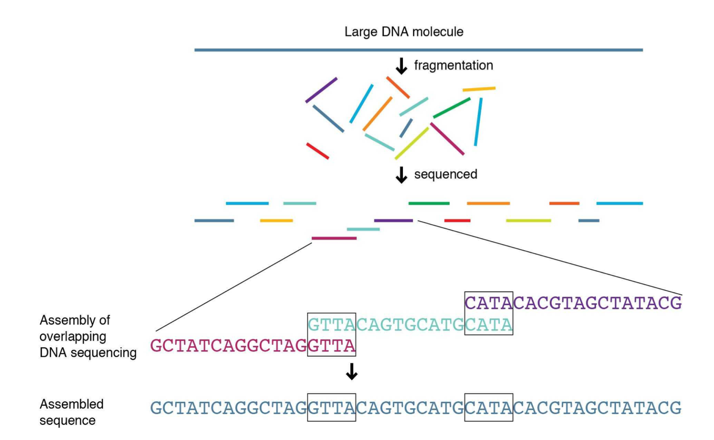

# Shotgun Sequencing

​				 					 		

​				 						 		

## Steps

1) Break up genome randomly into fragments 

2) Read fragments 

3) Assemble fragments into a genome with computers 

## Important Characteristics

* **Coverage**

  * how many fragments/reads cover one nucleotide on the genome

  * The depth of coverage is a measure of the number of times that a  specific genomic site is sequenced during a sequencing run. In exome  sequencing, for example, the target might be 60X coverage, meaning that — on average — each targeted base is sequenced 60 times. This does not  mean that every targeted base is sequenced every time; some segments may be read 100 or more times, while others might only be read once or  twice, or not at all. In exome sequencing our average target is that 85% of targeted bases are covered at least 15 times, and 90% of targeted  bases are covered at least 10 times. The higher the number of times that a base is sequenced, the better the quality of the data.

    For RNA-seq, we generally recommend a minimum of 20 million reads per sample. For sequencing projects that require higher accuracy — such as  studies of alternate splicing — 40 million to 60 million paired-end  reads will provide better results. For more detailed analyses to  determine, for example, allele-specific expression or expression of  low-abundant transcripts, 60 million to 100 million reads may be  required.

* **Read Length** (Fragment Length)

  * During sequencing, it is possible to specify the number of base pairs  that are read at a time. For example, one read might consist of 50 base  pairs, 100 base pairs, or more. Longer reads can provide more reliable  information about the relative locations of specific base pairs. (This  helps to address a common challenge that arises in sequencing because  the same read sequences can appear in multiple places within a genome.)  However, it is usually more expensive to generate longer reads.

* **Paired-end vs Single-end Reads**

  * Two DNA fragments at both ends of the sequence read 
    * AAAGGGTTT-------------TTTTTTAAAGGC 
    * We know the distance between fragments denoted by - here which is 13 
    * This is the same for all paired-end reads → contains additional information → makes assembly process easier
  * In single-end reading, the sequencer reads a fragment from only one end  to the other, generating the sequence of base pairs. In paired-end  reading it starts at one read, finishes this direction at the specified  read length, and then starts another round of reading from the opposite end of the fragment. Paired-end reading improves the ability to identify the relative positions of various reads in the genome, making it much  more effective than single-end reading in resolving structural  rearrangements such as gene insertions, deletions, or inversions. It can also improve the assembly of repetitive regions. This degree of  accuracy may not be required for all experiments, however, and  paired-end reads are more expensive and time-consuming to perform than  single-end reads.

* ***De novo* versus *by reference* assembly**

  * By reference: we want to assemble the genome of species X → there is a closely related species Y whose genome is already available → map reads of X to genome of Y to assemble them → also known as read mapping
  *  De novo: we want to assemble the genome of species X → there is no closely related species of X whose genome is already available → assemble genome out of read soup → computational problem is much harder, in particular when reads are short

[source 1](https://cme.h-its.org/exelixis/web/teaching/lectures16_17/lecture2.pdf), [source 2](https://systemsbiology.columbia.edu/genome-sequencing-defining-your-experiment)

